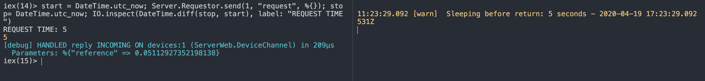

# Phoenix Synchronous Server requests example

And idea for handling synchronous requests from the server on a channel and support distribution.

Specifically for [this forum question](https://elixirforum.com/t/how-to-send-request-to-phoenix-channel-client/19009/2)

## Test

Start the `server` and `client` apps separately:

```sh
$ cd server && iex -S mix phx.server
```

```sh
$ cd client && iex -S mix
```

The `client` app starts a single channel for device ID `1`. Make a request to it from the server shell session

```elixir
Server.Requestor.send(1, "request", %{})
```

The client gets the request and sleeps for a random time between 1-10 seconds. It out puts a log. The server call should be blocking

